# 0.1 Course Orientation

Welcome to your transformation from AI curious to AI capable! This section helps you understand exactly where this journey will take you and builds the confidence needed to get there.

## Your AI Transformation Journey

### Where You Are Now (Don't worry - we've all been here!)

You might be thinking:
- "AI sounds powerful, but I don't know where to start"
- "I've tried ChatGPT a few times, but I'm not getting great results"
- "This technology changes so fast - how do I keep up?"
- "I'm not technical enough to use AI professionally"

**Good news**: These feelings are completely normal, and this course is designed specifically for people who feel this way.

### Where You'll Be After This Course

By completion, you'll confidently create AI systems that work like this:

**Level 1: Intelligent Individual Tasks** (Modules 0-3)
You'll write prompts that consistently get excellent results, like:
- Analyzing complex documents and extracting key insights
- Writing professional communications that match your voice
- Research that saves you hours and delivers better quality

**Level 2: Connected AI Tools** (Modules 4-6)
Your AI will connect to your existing work tools:
- AI that reads your emails and drafts responses
- Automated analysis of your company data files
- AI assistants that understand your specific work context

**Level 3: Autonomous AI Workers** (Modules 7-9)
You'll deploy AI agents that work independently:
- An AI researcher that monitors industry trends and writes weekly summaries
- A customer service agent that handles routine inquiries 24/7
- A project manager that tracks deadlines and sends status updates

**Level 4: Multi-Agent Orchestration** (Modules 10-12)
You'll coordinate teams of specialized AI agents:
- A complete content creation pipeline (research + writing + editing + publishing)
- Automated business intelligence (data collection + analysis + reporting + alerts)
- Customer journey automation (lead capture + qualification + nurturing + handoff)

## The Mindset Shift That Changes Everything

### From "AI as Advanced Google" to "AI as Intelligent Workforce"

Most people get stuck thinking about AI like this:

!!! example "Limited Thinking"
    **Question**: "What's the weather today?"

    **AI Response**: "It's 72°F and sunny."

    **Your Action**: Read the answer and close the conversation.

But AI-powered professionals think like this:

!!! success "Expanded Thinking"
    **Initial Request**: "Help me plan my quarterly business review presentation"

    **AI System Response**:
    - Analyzes your last 3 months of sales data
    - Identifies trends and creates visualizations
    - Drafts presentation outline with key talking points
    - Suggests follow-up actions based on performance gaps
    - Schedules reminders for implementation milestones

    **Your Action**: Review, refine, and approve - then watch it execute.

### Real-World Transformation Examples

Here's how course graduates describe their transformation:

!!! quote "Sarah, Marketing Manager"
    "Before: I spent 3 hours each Monday creating weekly reports from our analytics tools.

    After: My AI agent automatically generates comprehensive reports every Monday at 8 AM, including trend analysis and strategic recommendations. I just review and share them."

!!! quote "Mike, Small Business Owner"
    "Before: Customer service emails consumed my evenings and weekends.

    After: An AI agent handles 80% of customer inquiries instantly. I only get involved for complex issues that need human judgment."

## Your Learning Path: From Prompts to Production

```mermaid
graph TD
    A["🎯 Prompting Mastery<br/>Write AI instructions that work"] --> B["🔧 Tool Integration<br/>Connect AI to your apps"]
    B --> C["🤖 Single Agents<br/>Create AI workers for specific tasks"]
    C --> D["👥 Multi-Agent Systems<br/>Coordinate teams of AI specialists"]
    D --> E["🏭 Production Workflows<br/>Deploy reliable, scalable AI systems"]

    style A fill:#e1f5fe
    style B fill:#f3e5f5
    style C fill:#fff3e0
    style D fill:#e8f5e8
    style E fill:#fff8e1
```

### Module-by-Module Skill Building

**Foundation Phase (Modules 0-3)**
- Module 0: Tools and mindset setup
- Module 1: Writing prompts that consistently work
- Module 2: Advanced prompt strategies for complex tasks
- Module 3: Understanding AI capabilities and limitations

**Integration Phase (Modules 4-6)**
- Module 4: Connecting AI to your existing tools
- Module 5: Working with your data (Excel, databases, APIs)
- Module 6: Model Context Protocol (MCP) for advanced integrations

**Automation Phase (Modules 7-9)**
- Module 7: Building your first autonomous agent
- Module 8: Agent skills and specialized capabilities
- Module 9: Deployment and monitoring strategies

**Orchestration Phase (Modules 10-12)**
- Module 10: Multi-agent system architecture
- Module 11: Workflow tools for agent coordination
- Module 12: Production systems and scaling

## Interactive Exercise: Your AI Vision

Let's get specific about your goals. Complete this exercise honestly - there are no wrong answers.

### Part 1: Current State Assessment

Think about your typical work week and answer:

1. **Time Drain Identification**
   - What tasks take up the most time but feel repetitive?
   - Which activities do you avoid because they're tedious?
   - Where do you find yourself doing the same thing over and over?

2. **Quality Challenges**
   - What tasks would you like to do better but lack time/resources?
   - Where could you benefit from having a "second brain" to catch things you miss?
   - What research or analysis do you wish you could do more thoroughly?

3. **Capacity Limitations**
   - What would you do if you had an extra 10 hours per week?
   - What projects have you delayed because they require too much manual work?
   - Where could 24/7 availability benefit your work or customers?

### Part 2: AI Vision Creation

Based on your answers above, imagine having AI assistance that could:

!!! question "Your 6-Month Vision"
    Complete these statements:

    "Six months from now, I want AI to automatically handle..."

    "I want to spend my reclaimed time on..."

    "The biggest impact on my work/business would be if AI could..."

### Part 3: Fear and Concern Acknowledgment

Be honest about your concerns - addressing them early helps tremendously:

**Common Concerns (check any that resonate):**
- [ ] "I'll become too dependent on AI"
- [ ] "AI will make mistakes I don't catch"
- [ ] "This is too technical for someone like me"
- [ ] "AI changes too fast to keep up"
- [ ] "My industry/role is too specialized for AI"
- [ ] "I'm worried about privacy and security"
- [ ] "This feels like it will replace human workers"

!!! tip "Addressing Your Concerns"
    We'll address each of these concerns throughout the course with practical strategies and safeguards. Your worries are valid and shared by most professionals entering AI-powered work.

## Knowledge Check: Orientation Concepts

Before moving forward, test your understanding:

??? question "1. What's the main difference between traditional AI use and AI-powered work systems?"
    Traditional AI use treats AI like an advanced search engine for single questions and answers. AI-powered work systems integrate AI as intelligent teammates that can handle multi-step processes, learn from context, and work autonomously.

??? question "2. What are the four levels of AI capability you'll develop in this course?"
    1. Intelligent Individual Tasks (better prompting)
    2. Connected AI Tools (integration with existing apps)
    3. Autonomous AI Workers (independent agents)
    4. Multi-Agent Orchestration (coordinated AI teams)

??? question "3. Name one specific benefit of moving beyond simple AI prompting."
    AI can handle entire workflows instead of single tasks, freeing you to focus on strategic work while maintaining higher quality and consistency in routine operations.

## Reflection and Goal Setting

Take 10 minutes to complete this reflection:

### My AI Learning Commitment

**Primary Goal**: In one sentence, describe what success with AI would look like for your work:

*"Success with AI would mean..."*

**Specific Learning Targets**: Choose 2-3 skills you're most excited to develop:
- [ ] Writing prompts that consistently get great results
- [ ] Connecting AI to my existing tools and data
- [ ] Creating AI agents that work independently
- [ ] Building systems of multiple AI agents working together
- [ ] Other: ________________

**Time Commitment**: How will you structure your learning?
- [ ] 30 minutes daily for focused progress
- [ ] 2-3 longer sessions per week
- [ ] Weekend intensive sessions
- [ ] Other schedule: ________________

**Success Metric**: How will you know this course was valuable?

*"I'll know this course was successful when..."*

## Coming Up Next

You're now oriented and ready to build! In the next section (0.2 Essential Setup), you'll:

- Create your free accounts on all major AI platforms
- Install the essential tools for AI development
- Learn basic command-line operations that unlock advanced AI capabilities
- Set up your first AI conversation that gets real results

The technical setup might feel intimidating, but remember: every step is explained with beginners in mind, and you're building capabilities that will serve you for years to come.

!!! success "Orientation Complete!"
    You've set your vision, acknowledged your starting point, and committed to the journey. That's the hardest part done. Everything from here is just following the step-by-step guidance to bring that vision to life.