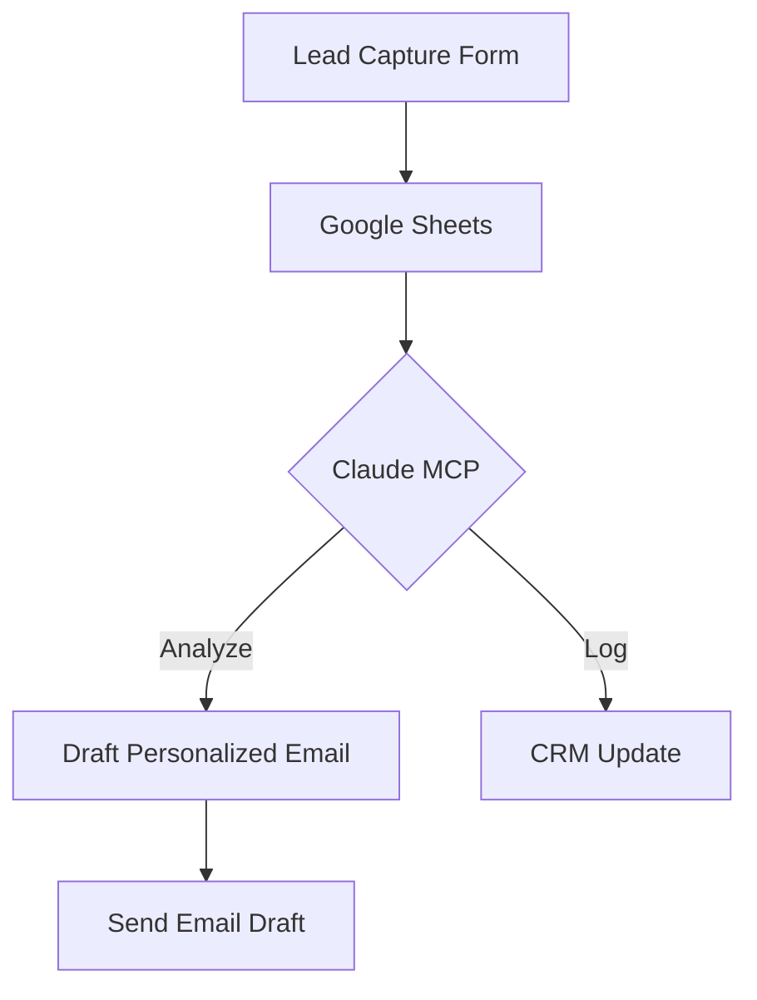

# Practical MCP Configuration

## Workflow Automation Exercise

### Scenario
You're a marketing coordinator who wants to streamline lead capture and follow-up.

### MCP Configuration Tasks
1. Connect Google Workspace MCP Server
2. Set up automated lead capture workflow
3. Configure email draft generation
4. Create a basic reporting system

### Required Tools
- Claude Desktop
- Google Workspace account
- Basic spreadsheet
- Optional: Zapier or n8n for advanced routing

### Workflow Design

### Evaluation Criteria
- Successful MCP server connection
- Automated workflow logic
- Error handling
- Documentation of process