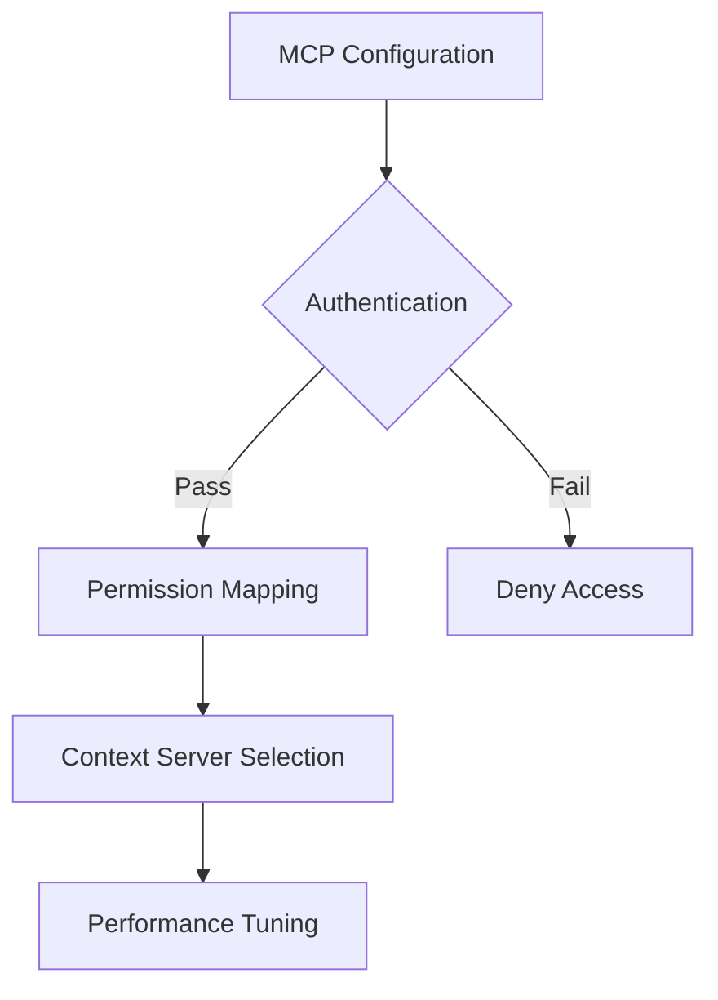

# 4.5 Claude Desktop MCP Configuration

## Configuring Claude Desktop for Optimal MCP Performance

### Initial Configuration Steps
1. Launch Claude Desktop
2. Open Settings > MCP Configuration
3. Select "Advanced MCP Integration"

### Recommended MCP Settings
- Enable all essential MCP servers
- Set granular permission levels
- Configure default context servers

### Permission Management
- Read-only vs. Read-Write access
- Per-tool permission settings
- Audit log tracking

### Performance Optimization
- Limit concurrent MCP connections
- Set caching and rate limits
- Choose optimal server regions

### Security Checkpoints

### Best Practices
- Regularly update Claude Desktop
- Review MCP server permissions
- Use multi-factor authentication
- Monitor connection logs